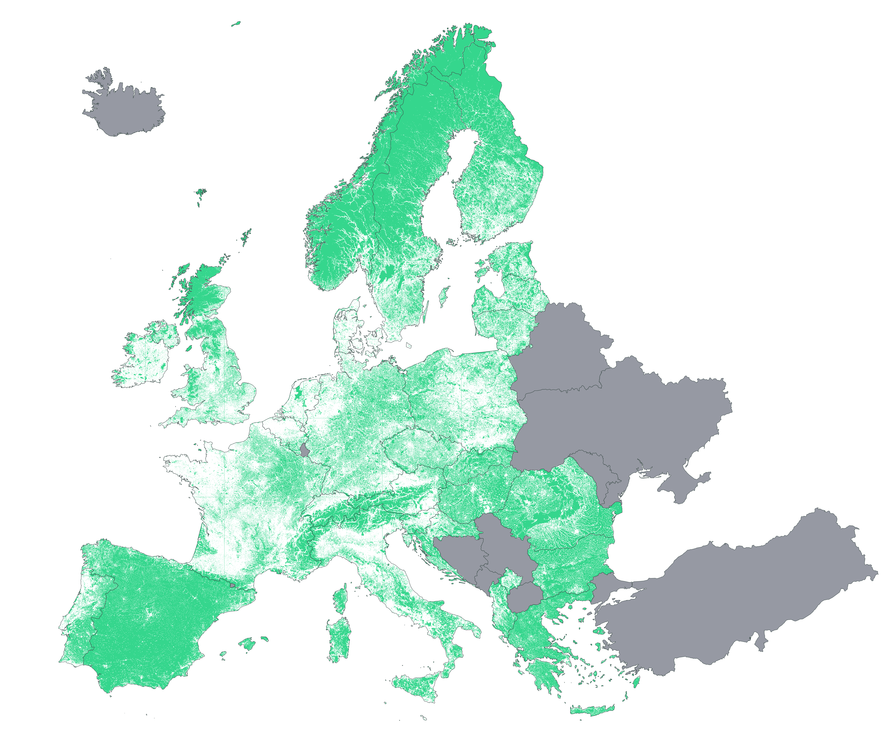

# Population Density Map

This repo contains the code for the analysis of the population density in Europe and in Spain. It covers the entire data ETL pipeline: data extraction from european and spanish public institutions, data transformation and analysis, and a visualization stage. 

Please, notice that the used datasets are quite large in size, and thus the project has been concieved from an educational point of view, always looking for the maximum efficiency in the entire pipeline. 

<div align="center">
	
	
</div>

<a href="https://github.com/imartinezl/population-map/blob/master/R/images/europe_600ppi_16x8_crop.png?raw=true" target="_blank">High resolution image</a>

## What I wanted to do

- **Visualize the least populated regions in Europe**

I was very much inspired by [this article](https://www.citymetric.com/fabric/nine-things-we-learned-population-density-map-europe-3775) where John Elledge introduces the visualization of [Dan Cookson](https://twitter.com/danc00ks0n), a map with the EU Population at 2011 onto a 1km grid. This great visualization is available [here](https://dancooksonresearch.carto.com/u/dancookson/viz/49ca276c-adf9-454a-8f64-0ccf0e46eed0/embed_map).

- **Learn how to approach the visualization of large spatial datasets**

Prior to this project, I had some experience working with small spatial datasets. Therefore, a large dataset presented a nice challenge! The european 1km per 1km square grid dataset comprises over 2.000.000 features that need to be processed and rendered onto the map.

## Data Sources

- **Europe Grid**: GEOSTAT-grid-POP-1K-2011-V2-0-1

   Detailed grid (1km resolution) available at [eurostat](https://ec.europa.eu/eurostat/web/gisco/geodata/reference-data/population-distribution-demography/geostat). Download [link](https://ec.europa.eu/eurostat/cache/GISCO/geodatafiles/GEOSTAT-grid-POP-1K-2011-V2-0-1.zip) (.zip file)

- **Spain Grid**: ETRS89_LAEA_ES_1K

   Digitalized cartography (1km resolution grid) of the Spanish territory, available at [INE](http://www.ine.es/censos2011_datos/cen11_datos_resultados_rejillas.htm). Download [link](http://www.ine.es/censos2011_datos/RJ_CPV_20111101_TT_02_R_INE.zip) (.zip file)

- **European countries contour**
   
   Vector maps in GeoJSON format are downloaded from [this online service](https://geojson-maps.ash.ms/)

  An online geodata [converter](https://mygeodata.cloud/converter/geojson-to-latlong) is used to transform the contour coordinate system from **WGS 84 (EPSG:4326)** to **ETRS89 / LAEA Europe (EPSG:3035)**. This is a necessary conversion due to the fact that the grid coordinates are represented with the latter system.

## Project Structure

```
population-map
│   README.md
│   index.html 
│
└───data
│   └───grid
│   |   └───GEOSTAT-grid-POP-1K-2011-V2-0-1
│   |   └───Grid_ETRS89_LAEA_ES_1K
|   |	└───RJ_CPV_20111101_TT_02_R_INE
|   |
│   └───contour
|	|   contour_eu.geojson
|	|   contour_spain.geojson
|
└───R
│   │   data_preprocessing.R
│   │   map_exploration.R
│   │   map_interactive.R
│   │   map_visualization.R
```

## What it does

1. Data Preprocessing

Prior to the visualization stage, there is a data preprocessing stage in which some tasks are carried out: 

- **Coordinate system conversion function**: subsequently used function to transform coordinates in system from *ETRS89 / LAEA Europe (EPSG:3035)* to the universal *WGS 84 (EPSG:4326)* system. 

- **Contour dataset**: The polygon coordinates are extracted from the GeoJSON files and arranged in R's data.frame format to be exported to CSV. In the process, the coordinate system is converted as described above. Both for Spain and EU. 

- **Grid + Population dataset**: Instead of reading the huge shapefile containing all the geographical information, I imported a CSV file that just summarized the population of each cell from the grid. The cell ID string contained the ETRS89 coordinates (North-East), that were extracted and then converted to WGS 84 (latitude-longitude).

 
2. Data Export: GeoJSON vs Vector Tiles

Once the data was correctly processed, it had to be exported to the common formats to store spatial information. 

- GeoJSON

Built from scratch using R and the library jsonlite, the data was shaped into a collection of features (simple polygons), like this:

```
{
   "type":"FeatureCollection",
   "features":[
      {
         "type":"Feature",
         "geometry":{  
            "type":"Polygon",
            "coordinates":[[
		[10.2181,47.3189],
		[10.218,47.3099],
		[10.2048,47.3099],
		[10.2049,47.3189],
		[10.2181,47.3189]
		]]
         },
         "properties":{  
            "p":8,
            "e":false
         }
      },
      {
         "type":"Feature",
         "geometry":{  
            "type":"Polygon",
            "coordinates":[[
		[10.271,47.3188],
		[10.2709,47.3098],
		[10.2577,47.3098],
		[10.2577,47.3188],
		[10.271,47.3188]
		]]
         },
         "properties":{  
            "p":7,
            "e":false
         }
      }
   ]
}
```

3. Map Visualization

- Offline (static) visualization

Library ggplot2 for R is used to visualize the population density both in Europe and in Spain. Apart from the population quantity, I also included a map that highlighted the 1km sq cells with no population, which can lead to some interesting analysis.

- Online (interactive) visualization

Regarding interactive visualizations, two platforms were studied: [CARTO](https://carto.com/) and [Mapbox](https://www.mapbox.com/).

On one side, the Student plan from CARTO just offered 350 MB of data storage, whereas the free tier plan from Mapbox offered much larger storage for tilesets (50 GB). Moreover, CARTO Import API does not support MBTiles, so the only remaining alternative was to upload the entire GeoJSON file to be imported and processed into a SQL-like table with the polygon coordinates. Check the CARTO supported formats on the [CARTO Documentation](https://carto.com/developers/import-api/guides/importing-geospatial-data/#supported-geospatial-data-formats).

Therefore, these two points (storage limit and supported formats), were the main reasons not to select CARTO as the visualization platform. Thus, the decision was inclined towards Mapbox.

<p align="center">
   
   
</p>

In this sense, apart from using the online platform Mapbox Studio, I also explored the way of self-hosting the map and the tiles. This track will be further explained on the next section.

4. Self-Hosted Map Tiles

The reference I followed on this stage was this [article](https://geovation.github.io/build-your-own-static-vector-tile-pipeline) by [James Gardner](https://www.linkedin.com/in/james-gardner-47a66b2). In the article Mapbox vector tiles are introduced, with a very clear comparison (pros and cons) with GeoJSON or TopoJSON formats.

I also the checked this GitHub [repo](https://github.com/klokantech/vector-tiles-sample) by [Klokan Technologies GmbH](https://github.com/klokantech), where they display vector tiles with a local copy of MapBoxGL JS.


- Generate GEOJSON

https://geovation.github.io/build-your-own-static-vector-tile-pipeline

- MBTiles generation with tippecanoe
tippecanoe -o tile*.mbtiles -zg --coalesce-densest-as-needed --extend-zooms-if-still-dropping test_*.geojson

tippecanoe --no-tile-compression --no-feature-limit --no-tile-size-limit --drop-densest-as-needed --minimum-zoom=0 --maximum-zoom=11 --output-to-directory "tiles" ./data/complete.geojson

live-server --port=8000 --middleware="${PWD}/www/gzip.js" --host=localhost --browser=chromium-browser www

tippecanoe --cluster-densest-as-needed --minimum-zoom=0 --maximum-zoom=9 --output-to-directory "tiles_tmp1" ./data/complete.geojson

tippecanoe --drop-densest-as-needed --minimum-zoom=0 --maximum-zoom=9 --output-to-directory "tiles_tmp2" ./data/complete.geojson

tippecanoe --no-tile-size-limit --minimum-zoom=0 --maximum-zoom=9 --output-to-directory "tiles_tmp2" ./data/complete.geojson


- Upload to Mapbox


- Countries Covered

- Color Scale
10-50-100-1000-5000-10000->10000
#d2fbd4,#a5dbc2,#7bbcb0,#559c9e,#3a7c89,#235d72,#123f5a
https://carto.com/carto-colors/

## Challenges I run into

## Accomplishments that I'm proud of

## What I learned

## What's next


## How I built it

- [R](https://www.r-project.org/) - Programming Language / 3.5.2
- [RStudio](https://www.rstudio.com/) - IDE for R / 1.1.463 
- [dplyr](https://dplyr.tidyverse.org/) - A grammar of data manipulation / 0.7.8 
- [data.table](https://cran.r-project.org/web/packages/data.table/vignettes/datatable-intro.html) - Data manipulation operations / 1.12.1
- [sf](http://r-spatial.github.io/sf/) - Simple features access for R / 0.7-3
- [stringr](https://stringr.tidyverse.org/index.html) - Library for string manipulations / 1.4.0
- [sp](https://github.com/edzer/sp/) - Classes and methods for spatial data / 1.3.1
- [jsonlite](https://github.com/jeroen/jsonlite) - A Robust, High Performance JSON Parser and Generator for R / 1.6
- [ggplot2](https://ggplot2.tidyverse.org/) - Grammar of Graphics for R / 3.1.0
